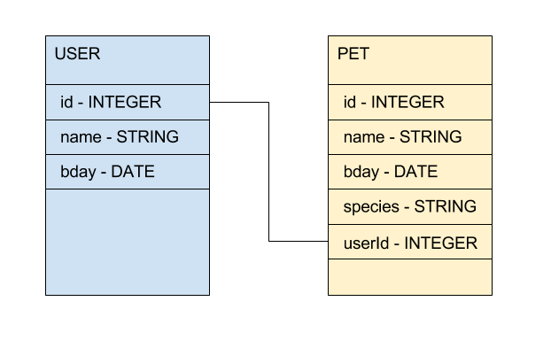

# SQL

**Objectives**

  * List the various features of a SQL database: e.g. Tables, Indexes, Migrations, and Joins
  * Compare and Contrast SQL/Relational/Table-based and NoSQL/Schemaless/Document-based databases
  * Write the SQL to create tables, columns, and rows
  * Write basic SQL queries

## Background

Pronouncd: "ess-que-el" or "sequel" - SQL is the language used with table-based, relational databases such as MySQL, SQLite, and PostgreSQL.

SQL was initially developed at IBM by Donald D. Chamberlin and Raymond F. Boyce in the early 1970s. This version, initially called SEQUEL (Structured English Query Language).

"SQL is a domain-specific language used in programming and designed for managing data held in a relational database management system. [SQL - Wikipedia](https://en.wikipedia.org/wiki/SQL)

SQL/Relational databases are enormously prevalent, more common in fact than Schemaless/NoSQL/Document-based databases, and SQL is the language you use to communicate with virtually any relational database.

Even stacks that use noSQL databases operationally, will often still maintain a SQL database for reporting purposes bc it is so fast and reliable.

Let's look at some of the simplest SQL features and commands.

## Tabular Data

All the data in a relational or SQL database is tabular, like an excel spreadsheet:

**Users Table**

| id | name  | email | age |
| -- | ----  | ------| ------ |
| 1  | Bob   | bob@bob.com  | 34  |
| 2  | Sally | sally@sally.com  | 87  |
| 3  | Nick | nick@nick.com  | 20  |

**Pets Table**

| id | name  | species | age | userId |
| -- | ----  | ------| ------ | ------ |
| 1  | Rex   | Razorback  | 9  | 3 |
| 2  | Mr. Bigglesworth | Parrot  | 43  | 3 |
| 3  | Snakey | Python  | 3  | 2 |
| 4  | Giggles | Cat  | 3  | 1 |
| 5  | Tony | Cat  | 9  | 1 |

Here are some observations about this data:

* Bob has two cats
* Snakey the python is owned by an 87 year old person named Sally
* Nick has a dog and a parrot

## The Schema

A SQL database is different from a NoSQL database primarily in that it has a schema that we have to build before we can save data to it.

Let's look at how we could define the above data into its **Schema**. A schema is the definition of a specific database. It specifies the **tables** and **columns** to represent the data. Each column has a name and a type of data that the database will require data to fit.

Here is an example image of a schema where each rectangle is a **table**, and each attribute is a **column** in the table. A **row** in a table is an instance of the resource.



The lines that connect the tables in the image above are **JOINs** that define **Associations**. We will look at JOINs more below.

Here are some observations about this schema:

* Users and pets have a `bday` column that is a date
* Pets and users have a `name` column
* Pets are associated with users
* Users have many pets

## Indexes

Another feature of SQL databases is the definition of **indexes** to speed up queries. Databases uses data structures like B-Trees to make column values fast to look up.

Think of the index of a book, an alphabetical list of names, subjects, etc., with references to the places where they occur, typically found at the end of a book. That is sort of what an index is in a SQL database.

When you set an index, e.g. on a `email` column on a user table, you tell the database to keep track of the order of every email address so later you can look up records by the email address very quickly.

## Common SQL Commands

1. Read the data  --  **SELECT**
1. Insert new data  --  **INSERT**
1. Update existing data  --  **UPDATE**
1. Remove data  --  **DELETE**

  What do these four remind you of...? (CRUD!)

1. Filter data -- **WHERE**
1. Designate which table you want to use -- **FROM**
1. Sort or order data -- **ORDER BY**
1. Set column values -- **VALUES, SET**

### SELECT, FROM, WHERE, ORDER BY

```sql
SELECT column-names
FROM table-name
WHERE condition
ORDER BY sort-order
```

e.g.

```sql
SELECT FirstName, LastName, City, Country
FROM Customer
WHERE City = 'Paris'
ORDER BY LastName
```

### INSERT, VALUES

```sql
INSERT table-name (column-names)
VALUES (column-values)
```

e.g.

```sql
INSERT Supplier (Name, ContactName, City, Country)
VALUES ('Oxford Trading', 'Ian Smith', 'Oxford', 'UK')
```

### UPDATE, SET

```sql
UPDATE table-name
SET column-name = column-value
WHERE condition
```

e.g.

```sql
UPDATE OrderItem
SET Quantity = 2
WHERE Id = 388
```

### DELETE

```sql
DELETE table-name
WHERE condition
```

e.g.

```sql
DELETE Customer
WHERE Email = 'alex@gmail.com'
```

### Joins - `JOIN`

Joins are how we make associations in SQL.

**Types of Joins**


1. (INNER) JOIN

  ```sql
  -- List all orders with customer information for orders by one customer

  SELECT OrderNumber, TotalAmount, FirstName, LastName, City, Country
    FROM [Order] JOIN Customer
      ON [Order].CustomerId = Customer.Id
  ```

  ```sql
  -- List all orders with product names, quantities, and prices and sort by Order number

  SELECT O.OrderNumber, CONVERT(date,O.OrderDate) AS Date,
         P.ProductName, I.Quantity, I.UnitPrice
    FROM [Order] O
    JOIN OrderItem I ON O.Id = I.OrderId
    JOIN Product P ON P.Id = I.ProductId
  ORDER BY O.OrderNumber
  ```

1. OUTER JOIN: OUTER JOIN types help where we want to retain those rows from either the LEFT side or the RIGHT or both (FULL) sides, for which there was no matching row where the predicate yielded true.

  ```sql
  SELECT *
  FROM author a
  LEFT JOIN book b USING (author_id)
  ```


  e.g. This query will produce all the authors and their books, but if an author doesn’t have any book, we still want to get the author with NULL as their only book value

**Creating a JOIN example**

```sql
create index IndexCustomerName on Customer (
LastName ASC,
FirstName ASC
)
go
```

## Baseline SQL Challenges - Interpreting a Schema


In groups of 2 write down as many observations as you can about the above schema.

## Baseline SQL Challenges - Schema Drawing

Now draw a schema diagram based on these observations:

* A unit belongs to a building
* Units have many tenants through leases
* Tenants have a `full name` attribute
* Buildings have an `streetAddress` attribute
* Units have a `number` attribute
* tenants have many pets

## Psuedocode for Queries


## Baseline SQL Challenges - todofactory

1. Examine the database and schema code in the `sample db` folder. Can you identify what each part of the files do?
1. With a partner construct 5 of your own simple queries for the dofactory sandbox and run them. For reference for this schema scroll up to the image above or look at [this page](http://www.dofactory.com/sql/tutorial) of their tutorial e.g:

  - Return all customers: `SELECT * from Customer`
  - Return all orders: `SELECT * from Order`

1. Use dofactory's [SQL Sandbox](http://www.dofactory.com/sql/sandbox) to run the example JOIN queries.

## Stretch SQL Challenges

1. Watch this great [TED talk on data visualization](https://www.ted.com/talks/david_mccandless_the_beauty_of_data_visualization)
1. Construct 3 JOIN queries for the dofactory sql sandbox and run it.
1. Review the types of Joins. With a partner come up with one hypothetical query (in English/psuedocode) that exemplifies each one. Share your queries with another two pairs.

## Extra Stretch

1. Write SQL queries for the psuedocode in `bank.sql` file.
