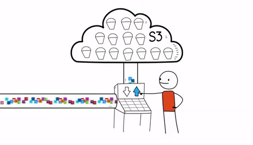

# Uploading Images with AWS S3


## Competencies & Objectives

* Upload files through a server to an AWS S3 bucket

## Intro

Uploading a custom image is a very common pattern on any website.

If you are using a NoSQL database like MongoDB we *could* just save the image into the database as binary data. However, we will quickly bloat our database this way and start paying a lot of $$$ to our database provider. In a SQL database we don't have this option.

Instead, we use a cloud storage service like Amazon AWS S3 or App Fog to store the image and deliver it to a specific URL. Then we'll store this URL in our database and use it to load the image any time we need it.

In this case we will be using Amazon AWS S3. This is not only more efficient and cheap, but we are continuing to employ a Service Oriented Architecture or even a "Microservices Architecture" in order to keep our stack modular, scalable, and lean.

There are various libraries that wrap the S3 API. On the simple end is just the `aws-sdk` module, but for this I've chosen that we use the `s3-uploader` module which allows us to resize and crop images and store multiple versions in S3.

There is also a new library my friend Scotty Ballantyne just made called [node-paperclip](https://github.com/ballantyne/node-paperclip) that models itself off of the ruby gem paperclip but works with Node.js and MongoDB.

In order for any of these libraries to work we'll have to accept an image through a form, interact with the AWS S3 service through their API, and .

## Diagram & Demo

**Conducted by Instructor**



## Resources

1. [AWS Management Console](https://aws.amazon.com/console/)
1. [`s3-uploader`](https://www.npmjs.com/package/s3-uploader)
1. [`multer`](https://www.npmjs.com/package/multer)

## Boiler Plate

```html
<form ... method="POST" **enctype="multipart/form-data"**>
   ...
   <div class="form-group">
     <label for="coverImg">Cover Image (1000px min width)</label>
     <input type="file" name="coverImg" class="form-control">
   </div>
   ...
</form>
```

```js
// IN CONTROLLER

// UPLOADING TO AWS S3
const multer  = require('multer')
const upload = multer({ dest: 'uploads/' })
const Upload = require('s3-uploader');

const client = new Upload(process.env.S3_BUCKET, {
  aws: {
    path: 'posts/coverImg/',
    region: process.env.S3_REGION,
    acl: 'public-read',
    accessKeyId: process.env.AWS_ACCESS_KEY_ID,
    secretAccessKey: process.env.AWS_SECRET_ACCESS_KEY
  },
  cleanup: {
    versions: true,
    original: true
  },
  versions: [{
    maxWidth: 320,
    aspect: '1.618:1',
    suffix: '-thumbnail'
  },{
    maxWidth: 1000,
    aspect: '2.414:1', //silver ratio
    suffix: '-desktop'
  },{
    maxWidth: 320,
    aspect: '2.414:1', //silver ratio
    suffix: '-mobile'
  },{
    maxWidth: 100,
    aspect: '1:1',
    suffix: '-square'
  }]
});

```

```js

// ADD upload.single() to route as middleware
app.post('/pets', upload.single('avatar'), function (req, res, next) {
/// ROUTE
}
```

```js
// IN CREATE ROUTE AFTER SAVE
if (req.file) {
  client.upload(req.file.path, {}, function (err, versions, meta) {
    if (err) { return res.status(400).send({ err: err }) };

    versions.forEach(function(image) {
      // console.log(image.width, image.height, image.url);
      // 1024 760 https://my-bucket.s3.amazonaws.com/path/110ec58a-a0f2-4ac4-8393-c866d813b8d1.jpg

      var urlArray = image.url.split('-');
      urlArray.pop();
      var url = urlArray.join('-');
      post.imgUrl = url;
      post.save();

      // Saving multiple images versions you can just save one url and then add the suffix to the
      // url to get the image from AWS later. e.g. 
    });

    res.send({ post: post });
  });
} else {
  res.send({ post: post });
}
```

```html

```

Hint - you will need `dotenv` to protect your AWS credentials.

Hint - install `imagemagick` with brew. (its a dependency for manipulating images).


## Readings

1. [History of AWS - TechCrunch](https://techcrunch.com/2016/07/02/andy-jassys-brief-history-of-the-genesis-of-aws/)
