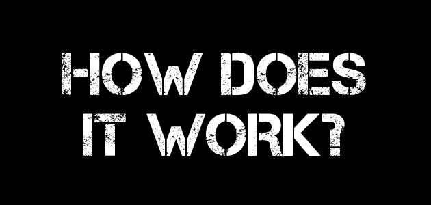
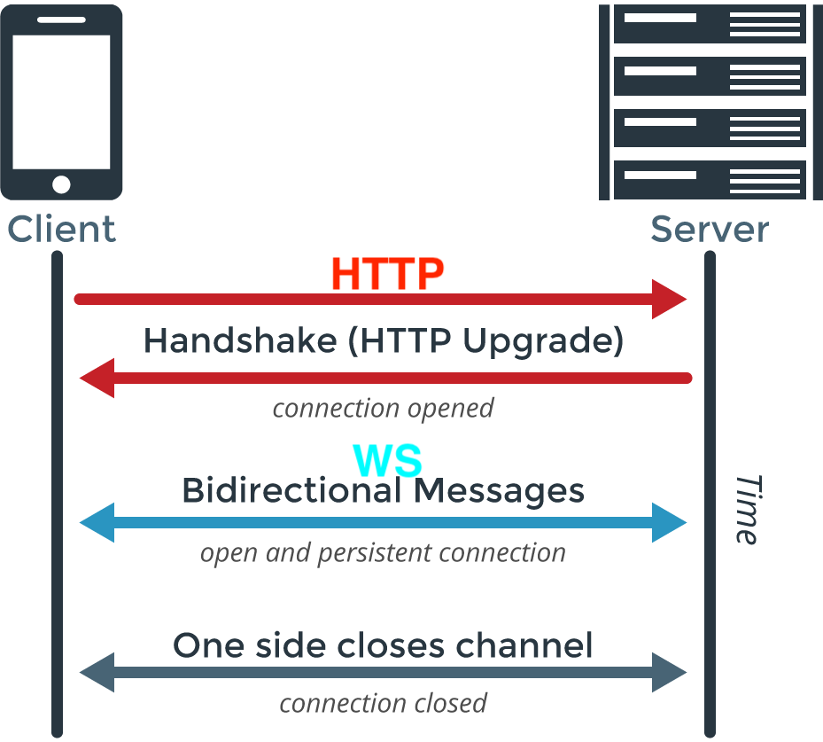
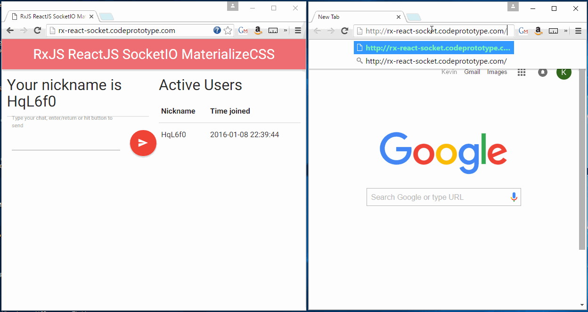

# Day 6: 🔌 Intro to Sockets

<!-- > -->

<!-- omit in toc -->
## ⏱ Agenda {docsify-ignore}

- Objectives
- LiteBrite
- What are Web Sockets?
- Sending Events
- Practice

<!-- > -->

## 🏆 Learning Outcomes

By the end of this lesson, you should be able to...

1. Identify the use cases for WebSockets
1. Compare and contrast the WS(S) and HTTP(S) protocols
1. Understand how events are sent between the front and back ends of applications

<!-- > -->

## LiteBrite


**Check out this [LiteBrite Demo](https://litebrite.live/)!**

- Keep one tab on the demo
- In another tab open the **Play Now** Link
- Follow the instructions in the Repl.it to manipulate the Lite Brite!

<!-- v -->



Any thoughts?

Let's talk about it!

<!-- > -->

## WebSocket History

Before we jump into building with websockets, lets take a second to look at where the WebSocket standard came from and how it works. Much of this complexity is buried into the libraries and tools we use, so lets take a minute to look at them.

As HTML5 was being developed, it became clear that the web needed a bidirectional **full-duplex** standard to allow for bidirectional communication.

<!-- v -->

## What was that?


### Bidirectional full-duplex!

- **Bidirectional**: communication happens two-ways: both parties can send and recieve messages
- **Full-Duplex**: sending and receiving can happen _simultaneously!_
    - When you call on your phone someone, that's a bidirectional full-duplex communication system! You both can talk listen simultaneously

<!-- v -->

## Back to WebSockets

**WebSockets work the same way as your phone!** They allow a client (i.e. phone) and a server to have bidirectional full-duplex communication!

### Question

How did this work with the LiteBrite demo we did earlier?

<!-- > -->

### HTML5 Bidirectional Communication => WebSocket

A new standard called WebSocket was recommended in June of 2008 by Michael Carter—an influential HTML5 game developer.

In February 2010, Google (being a champion of HTML5) made Chrome 4 the first browser to ship a full support of the standard and enabled by default with Safari 5.0.0 in a close second. The last was Internet Explorer 10 in December 2011.

The WebSocket standard begins with an **HTTP handshake**, but then switches to the **WebSocket Standard (WS, or WSS for WebSocket Secure)** that does not conform to the HTTP protocol.


<!-- v -->

Here's the same diagram, highlighting exactly where the upgrade from HTTP to WS occurs:



<!-- v -->

Here's an example of how the request for the handshake and the server's response looks:

```txt
GET /chat HTTP/1.1
Host: server.example.com
Upgrade: websocket
Connection: Upgrade
Sec-WebSocket-Key: x3JJHMbDL1EzLkh9GBhXDw==
Sec-WebSocket-Protocol: chat, superchat
Sec-WebSocket-Version: 13
Origin: http://example.com
```

Server response:

```txt
HTTP/1.1 101 Switching Protocols
Upgrade: websocket
Connection: Upgrade
Sec-WebSocket-Accept: HSmrc0sMlYUkAGmm5OPpG2HaGWk=
Sec-WebSocket-Protocol: chat
```

The request sends a `Sec-WebSocket-Key` which contains base64-encoded random bytes, and response responds with with a hash of the key in the `Sec-WebSocket-Accept` attribute which prevents resending old messages. This key/hash pattern does not provide any authentication, privacy, or integrity. WebSocket has unique security and privacy concerns.

For more information read this [WebSocket documentation](https://hpbn.co/websocket/).

<!-- > -->

## Communication between front and back ends

Back to the LiteBrite...

1. Which component was the front end?
1. Which component was the back end?

<!-- v -->

## Another Example



**Answer the below questions about this example:**

1. What does the back end do here?
1. What does the front end do here?
1. How is information shared between the back and front ends?

<!--update active users, update when a message gets sent/displayed-->

<!-- > -->

## Use Cases for WebSockets


 <br />


## What other use cases can you think of?

<!-- > -->

## [**10m**] 🌴 BREAK {docsify-ignore}

<!-- > -->


## The Code

In the following tutorial we'll be using [Socket.io](https://socket.io/) one of the most reliable npm modules on the web that enables node servers to respond to event-driven WebSocket behaviors. Socket.io is a broad and powerful library that can manage multiple channels, rooms, and manage https and other forms of security. In our case we will be implementing a simple asynchronous push of data from the server to the client.

Remember that since the client and the server are communicating via WebSockets, Socket.io will have client and server-side libraries that you will need to initialize in your project. A simple example is as follows:

```html
<!-- CLIENT -->
<script src="/socket.io/socket.io.js"></script>
<script>
  var socket = io('http://localhost');

  socket.emit('ferret', 'tobi', function (data) {
    console.log(data); // data will be 'woot'
  });
</script>
```

```js
// SERVER
var io = require('socket.io-client')('http://localhost');
io.on('connection', function (socket) {
  socket.on('ferret', function (name, fn) {
    fn('woot');
  });
});
```

<!-- v -->

Hint: If you are starting your server you need to include io in that server.

> **NOTE** - `broadcast.emit()` and `emit()` are different. `emit()` sends to all attached sockets, `broadcast.emit()` sends to all except the one that is sending the message.

```js
// SERVER
var app = require('express')();
var http = require('http').Server(app);
var io = require('socket.io')(http);

app.get('/', function(req, res){
  res.sendFile(__dirname + '/index.html');
});

io.on('connection', function(socket){
  console.log('a user connected');
});

http.listen(3000, function(){
  console.log('listening on *:3000');
});
```

<!-- > -->

## Try It Yourself

**Follow the [Getting Started project from Socket.io](https://socket.io/get-started/chat/)**

1. Complete the project
1. Finish at least 2 of the "Homework" bullets

**Stretch Challenge:** finish _all_ of the "Homework" bullets!

<!-- > -->

## Resources

1. [WebSocket Example](http://codepen.io/voku/pen/GpVoNN?editors=1010)
1. [REST vs. WebSockets (PubNub)](https://www.pubnub.com/blog/2015-01-05-websockets-vs-rest-api-understanding-the-difference/)
1. [Introducing WebSockets: Bringing Sockets to the Web](https://www.html5rocks.com/en/tutorials/websockets/basics/)
1. [What are WebSockets (Pusher)](https://pusher.com/websockets)
